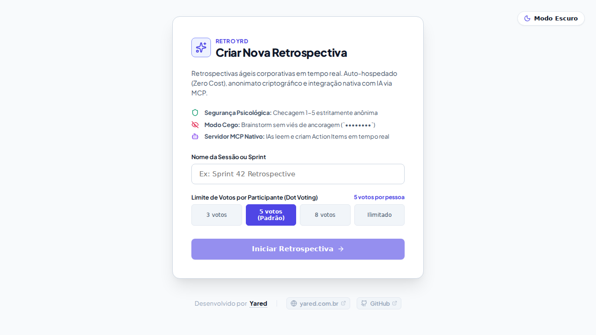

## O Desafio

Retrospectivas são os ritos ágeis mais sensíveis de uma equipe de engenharia: é onde se discutem falhas operacionais, gargalos arquiteturais, frustrações de processo e planos de melhoria contínua. No entanto, o ecossistema de ferramentas corporativas apresenta dores críticas:

- **Custos Recorrentes e Restrições Artificiais:** Ferramentas SaaS de retrospectiva impõem cobranças por assento, cotas rígidas de quadros simultâneos e bloqueios de exportação de dados.
- **Soberania e Governança de Dados:** Submeter insights e discussões internas de engenharia para bancos de dados de terceiros representa um risco desnecessário de compliance e privacidade.
- **Segurança Psicológica Fragilizada:** Muitas plataformas mantêm rastros de autoria, IPs ou identificadores de sessão em votos e notas, reduzindo a franqueza dos membros do time.
- **Ausência de Automação Inteligente:** Facilitar retrospectivas exige sintetizar dezenas de notas dispersas e gerar planos de ação (Action Items) manualmente, sem suporte a copilotos de IA conectados ao board.

Para resolver essas dores, projetei e construí o **Retroyrd** ([repositório no GitHub](https://github.com/Yared98/retroyrd) e rodando em produção em [retro.yared.com.br](https://retro.yared.com.br/)): uma plataforma em tempo real, soberana, de custo zero de licenças (**Zero Cost**) e equipada com um servidor nativo de **Model Context Protocol (MCP)** para integração bidirecional com LLMs.

---

## Arquitetura de Alta Performance em Rust

O backend do Retroyrd foi projetado em **Rust** utilizando o ecossistema **Axum**, **Tokio** e **Tower**, priorizando latência sub-milissegundo, segurança de memória em tempo de compilação e pegada de recursos ultraleve:

```
[ Usuários (React SPA) ] <===== WebSocket =====> [ Axum + Tokio WebSocket Broker ]
                                                           |
                                             +-------------+-------------+
                                             |                           |
                                             v                           v
                                     [ FSM de 6 Fases ]          [ Servidor MCP ]
                                     (Transições Rust)         (JSON-RPC 2.0 /mcp)
                                             |                           ^
                                             v                           |
                                     [ SQLite (WAL) ]             [ Agentes de IA ]
                                   (Persistência Local)        (Claude / Copilotos)
```

1. **Pegada de Memória Mínima:** O binário nativo compilado em release consome **menos de 20MB de RAM** mesmo com dezenas de conexões concorrentes ativas, permitindo que a aplicação rode com folga nos menores containers do homelab.
2. **Event Broker em Memória com Tokio Broadcast:** Atualizações de estado (criação de cards, votos, transições de fase e reações) são despachadas por canais `tokio::sync::broadcast`, garantindo que todos os clientes conectados recebam deltas instantaneamente com overhead zero de pooling HTTP.
3. **Persistência Concorrente em SQLite (WAL Mode):** Um único arquivo SQLite com *Write-Ahead Logging* ativado oferece excelente taxa de escrita assíncrona, tolerância a falhas e facilidade de backup através de volumes de container, dispensando a complexidade de um banco de dados dedicado.

---

## Ciclo de Vida da Retrospectiva: FSM Estrita de 6 Fases

Para evitar estados inconsistentes (como votos acontecendo antes do agrupamento ou cards criados após o arquivamento), o fluxo de cada quadro é governado por uma **Máquina de Estados Finita (Finite State Machine)** tipada no backend:

```
[1. SAFETY_CHECK] ──> [2. BRAINSTORM] ──> [3. GROUPING] ──> [4. VOTING] ──> [5. ACTION_ITEMS] ──> [6. ARCHIVED]
```

### Regras Rigorosas em Cada Fase:

- **1. SAFETY_CHECK (Checagem de Segurança Psicológica):** Avaliação anônima (1 a 5). A tabela de dados não possui chaves estrangeiras, identificadores de usuário ou cabeçalhos de rede gravados, impossibilitando qualquer correlação técnica de votos. O facilitador tem acesso apenas à média consolidada.
- **2. BRAINSTORM (Modo Cego / Blind Brainstorm):** Participantes submetem suas impressões simultaneamente. Para prevenir viés de confirmação e influência social prematura, o servidor aplica **mascaramento em nível de tráfego de rede**: o participante enxerga seus próprios cartões, enquanto os cartões de colegas são transmitidos pelo WebSocket estritamente como `••••••••`.
- **3. GROUPING (Agrupamento Colaborativo):** Revelação simultânea de todos os conteúdos. Cards são movidos e agrupados por tópicos correlatos via drag-and-drop sincronizado.
- **4. VOTING (Votação Direcionada):** Cada participante consome sua cota configurada de votos para priorizar os temas mais relevantes para discussão.
- **5. ACTION_ITEMS (Planos de Ação):** Registro de responsáveis, tarefas concretas e prazos para endereçar os pontos levantados na retro.
- **6. ARCHIVED (Conclusão e Registro):** O quadro entra em modo somente-leitura com bloqueio total de mutações.

---

## Automação Bidirecional via IA com Model Context Protocol (MCP)

O grande diferencial de engenharia do Retroyrd é seu **servidor nativo de Model Context Protocol (MCP)** embutido diretamente no backend em Rust sob o endpoint `/mcp` (JSON-RPC 2.0).

Isso permite que agentes e copilotos de inteligência artificial (como Claude Desktop ou agentes autônomos) interajam dinamicamente com as retrospectivas como membros auxiliares da reunião:

### Resources Expostos para LLMs
- `retro://board/{board_id}/state`: Snapshot em tempo real com colunas, cards categorizados, autores anônimos e contagem de votos.
- `retro://board/{board_id}/metrics`: Métricas de participação, média de segurança psicológica e tópicos com maior densidade de interesse.

### Tools Invocáveis por Agentes de IA
- **`create_card`**: Permite ao agente de IA gerar sumários executivos ou propor planos de ação estruturados (Action Items) informando `board_id`, `content` e `is_action_item`. A ação reflete instantaneamente nas telas dos participantes via WebSocket.
- **`group_cards`**: O agente pode analisar semanticamente os cartões dispersos da fase de Brainstorm e consolidá-los sob tópicos comuns durante a fase de agrupamento.

```json
// Exemplo de payload processado pelo servidor MCP embutido
{
  "jsonrpc": "2.0",
  "method": "tools/call",
  "params": {
    "name": "create_card",
    "arguments": {
      "board_id": "8f3d1b2a-45c9-4b11-92be-62b8813a45c0",
      "column_id": "action-items",
      "content": "Definir política de retenção para logs do Nginx até a próxima sprint",
      "is_action_item": true
    }
  },
  "id": 1
}
```

---

## Engenharia Orientada a Especificações: OpenSpec

O desenvolvimento do Retroyrd não seguiu o modelo tradicional ad-hoc. O projeto foi concebido sob a metodologia **OpenSpec (Spec-Driven Development)**:

- **Especificações Formais:** Regras de negócio, transições de estado da FSM e fluxos de segurança foram escritos previamente em formato EARS (*Easy Approach to Requirements Syntax*) e cenários *Given/When/Then* no diretório `openspec/specs/`.
- **Governança de Agentes:** Diretrizes rígidas em `AGENTS.md` guiam os modelos na geração de código aderente às convenções do projeto.
- **Design System Ágil:** A interface web reativa em React e TypeScript adota o design system *Agile Cadence*, desenvolvido com paleta sóbria, microinterações e transições pensadas para foco e usabilidade em reuniões de time.

---

## Infraestrutura & Deploy no Homelab (Zero Cost)

Alinhado à filosofia de infraestrutura soberana e autossuficiente descrita na página do [Homelab](/homelab), o Retroyrd está implantado em produção com custo zero de infraestrutura:

- **Container Docker Otimizado:** Executado no container de apoio `docker-tools` (LXC 200 no Proxmox VE), dividindo recursos sem interferir nos serviços adjacentes.
- **Exposição Segura via Cloudflare Tunnel:** O tráfego externo para [retro.yared.com.br](https://retro.yared.com.br/) é intermediado pelo daemon `cloudflared` (túnel de saída TLS), eliminando a necessidade de abrir portas no roteador doméstico ou expor endereços IP da rede local.
- **Volume Local Persistido:** O arquivo de dados do SQLite é mantido em volume Docker sincronizado com rotinas de snapshot no storage ZFS do Proxmox.

---

## Análise de Trade-offs & Resultados

| Dimensão | Solução SaaS Comercial | Retroyrd (Construção Própria) |
| :--- | :--- | :--- |
| **Custo de Licenciamento** | Cobrança mensal recorrente por usuário ou board. | **R$ 0,00 (Zero Cost)** rodando em infraestrutura própria. |
| **Consumo de Memória** | Aplicações pesadas em nuvem / multitenant. | **< 20MB de RAM** (Rust Axum compilado). |
| **Privacidade dos Dados** | Armazenamento em servidores de terceiros. | **100% de Soberania** no Homelab interno. |
| **Garantia de Anonimato** | Voto rastreável por cookie/sessão de usuário. | **Anonimato criptográfico** e mascaramento em rede (`••••••••`). |
| **Interação com IA** | Inexistente ou limitada a prompts estáticos. | **Servidor nativo Model Context Protocol (MCP)**. |

### Conclusão

O Retroyrd comprova como a união de uma linguagem com garantias estritas como Rust, protocolos abertos e modernos como o MCP e uma infraestrutura self-hosted bem planejada permite criar ferramentas de nível corporativo que superam serviços comerciais em performance, privacidade e custo operacional.
